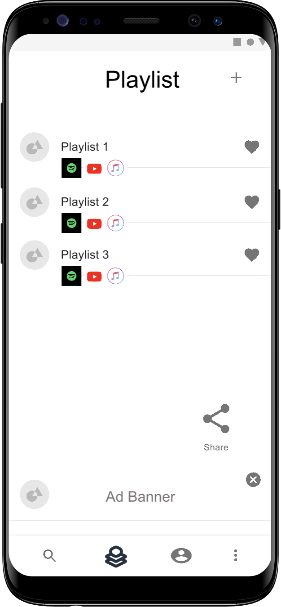
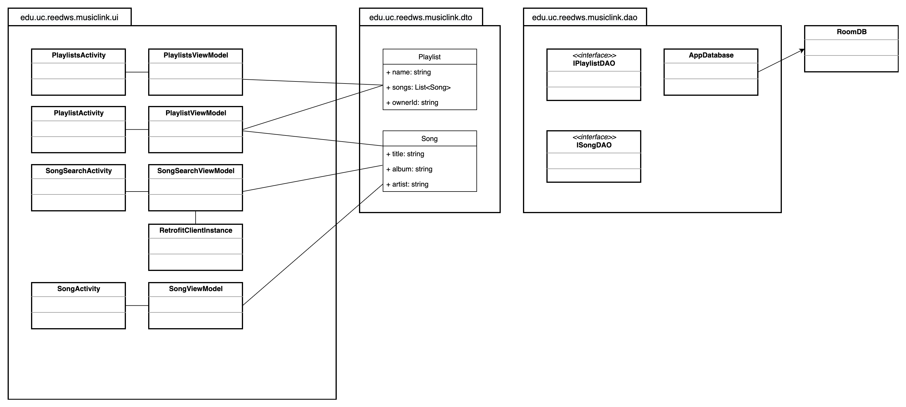

# Music Link

Design Document

Wes Reed, Ben Romig, Kaitlin Vo, and Dev Agrawal

## Introduction

Have you ever tried to share music with a friend but they didn’t use the same streaming service as you? (Spotify, Apple Music, YouTube Music, Amazon Music) With Music Link, you can:
* Build a playlist that can be opened from any streaming platform
* Share that playlist to your friends
* Collaborate on a playlist with your friends, regardless of what platform they use

## Storyboard

[Link to Storyboard](https://projects.invisionapp.com/prototype/Playlist-prototype-ckaonh87i00cgwb01v2le0xwo)

## Requirements

* [Requirement 1: Search for Songs](docs/requirements/Requirement1.md)
* [Requirement 2: Save Songs to Playlist](docs/requirements/Requirement2.md)
* [Requirement 3: Share Playlists with Others](docs/requirements/Requirement3.md)

## Class Diagram

[Download the Diagram File](docs/assets/musiclink-uml.drawio) (open with [draw.io](https://draw.io))

### Class Diagram Description

[wip]

## Scrum Roles
* **DevOps/Product Owner:** Wes Reed
* **UI Specialist:** Ben Romig
* **Integration Specialist:** Dev Agrawal
* **Monetization Specialist:** Kaitlin Vo

## Weekly Meetings
* [Standup Tuesday from 9 to 9:15](https://teams.microsoft.com/l/meetup-join/19%3ameeting_MWM3OTcyNGYtM2JlOS00NzEyLWEwOGMtYzFkODNmNGRjZGNj%40thread.v2/0?context=%7b%22Tid%22%3a%22f5222e6c-5fc6-48eb-8f03-73db18203b63%22%2c%22Oid%22%3a%22e1b08e73-d2dd-449a-848e-db26cd974c04%22%7d)
* [Meeting Thursday from 6 to 7](https://teams.microsoft.com/l/meetup-join/19%3ameeting_ODE4MjFmNzEtZWZlOC00YTFhLWJiOTgtZjE3MTQ0MTExMDkz%40thread.v2/0?context=%7b%22Tid%22%3a%22f5222e6c-5fc6-48eb-8f03-73db18203b63%22%2c%22Oid%22%3a%22e1b08e73-d2dd-449a-848e-db26cd974c04%22%7d)